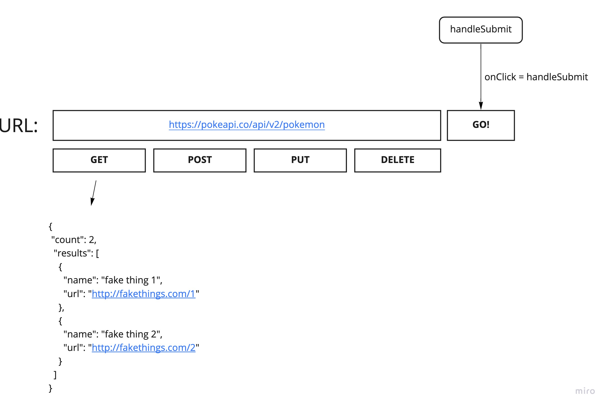

## RESTy

***

Created by Cameron Walden

***

RESTy is an API testing tool that can be run in any browser, allowing a user to easily interact with APIs in a familiar interface.

***

## Deployed Site

https://cameron-walden-resty.netlify.app/

***

## UML

